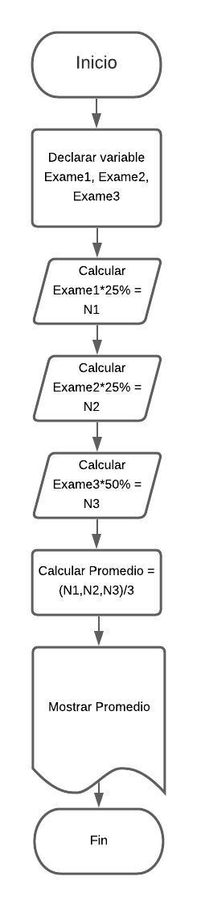

// Nota promedio
// Realizá el diagrama de flujo y pseudocódigo que representen el algoritmo para determinar el promedio que obtendrá un alumno considerando que realiza tres exámenes, de los cuales el primero y el segundo tienen una ponderación de 25%, mientras que el tercero de 50%.

1.Inicio

2.Declarar variable Exame1, Exame2, Exame3

3.Calcular Exame1*25% = N1

4.Calcular Exame2*25% = N2

5.Calcular Exame3*50% = N3

6.Calcular Promedio = (N1,N2,N3)/3

7.Mostrar Promedio

8.Fin

Format: 
